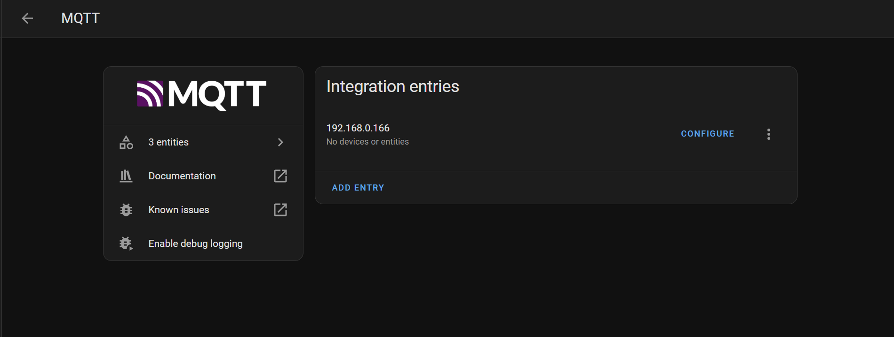
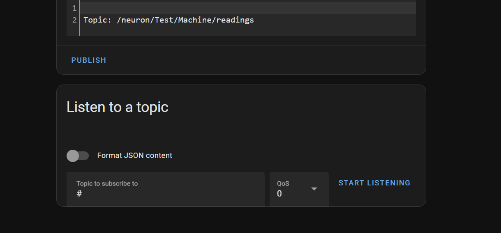
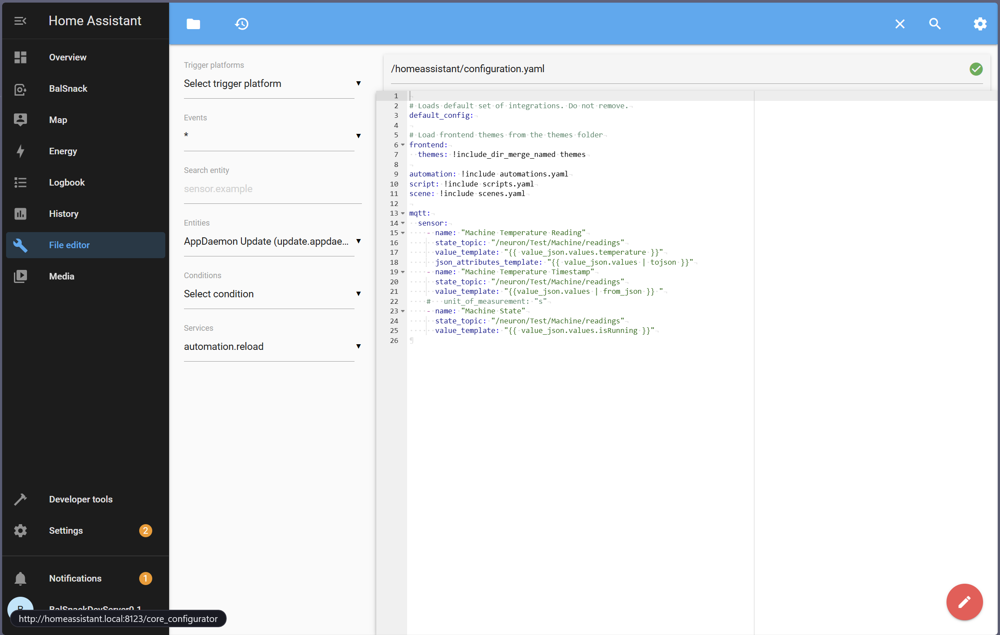
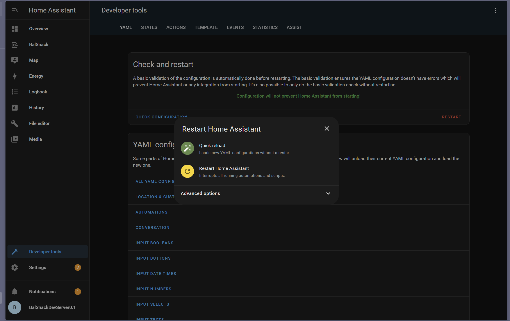

# Adding MQTT Data To Home Assistant

Here the process of adding MQTT topics collected from EMQX to Home Assistant is described.

## 1. Make sure that data is being sent to EMQX

This is described in the EMQX setup documentation. You can check the data being sent to EMQX using MQTTX or any other MQTT client.

## 2. Setting up MQTT plugin in Home Assistant

1. Navigate to Settings / Devices & Services
2. Click on "Add Integration"
3. Search for "MQTT" and select it
4. Enter the following details:
   - Host: `localhost`
   - Port: `1883`
   - Username: `` (blank, or any username, as it will be ignored by EMQX)
   - Password: `` (blank, or any password, as it will be ignored by EMQX)
The username and password are not required by default, unless you set them in EMQX. If you set them, use the same username and password as in EMQX. This can be done, by going to EMQX dashboard (http://localhost:18083) and navigating to "Authentication" -> "Users". You might also need to modify authorization rules under "Authorization"

5. Click "Submit". Having that done you should see the following screen:



6. You can check if data is being received by selecting "Configure" in the MQTT integration. And then going to listen to the topics. You should see the following screen:



Type `#` to listen to all topics. You should see the data being received from EMQX. If you see the data, it means that the integration is working correctly.

## 3. Adding a file explorer plugin for quick access to the configuration files
1. Navigate to Settings / Add-ons
2. Click on "Add-on Store"
3. Search for "File Editor" and select it
4. Click on "Install"
5. If the installation is successful, you should see File Editor in the sidebar



6. This will be used to add mqtt devices, as, unfortunately, HomeAssistant does not support adding devices via the UI. You can do it via the configuration.yaml file.

## 4. Adding devices to Home Assistant

1. Navigate to Settings / Add-ons
2. Click on "File Editor"
3. Make sure that the configuration.yaml file is selected
4. In the configuration.yaml file you will have to work with `mqtt` subsection and `sensor` within it.

You can add multiple sensors as YAML array like this:

```yaml
    - name: "Machine Temperature Reading"
      state_topic: "/neuron/Test/Machine/readings"
      value_template: "{{ value_json.values.temperature }}"
      json_attributes_template: "{{ value_json.values | tojson }}"
    - name: "Machine Temperature Timestamp"
      state_topic: "/neuron/Test/Machine/readings"
      value_template: "{{value_json.values | from_json }} "
    - name: "Machine State"
      state_topic: "/neuron/Test/Machine/readings"
      value_template: "{{ value_json.values.isRunning }}"
```
When you add it, add name, and state_topic (check itr form MQTTX). `value_template` is used to extract the value from the JSON object. You can use `json_attributes_template` to extract the attributes from the JSON object. You can also use `value_json` to extract the value from the JSON object. You can also use `from_json` to convert the JSON object to a dictionary.

It might differ between home assistant versions, so check the documentation for the version you are using: https://www.home-assistant.io/integrations/mqtt/

For specific configuration for sensor, check:
https://www.home-assistant.io/integrations/sensor.mqtt/

5. Save the configuration.yaml file
6. Soft-restart Home Assistant by going to Developer tools, and in "Check and Reload" section, click on "Restart" and then "Quick Reload"



7. After having that done, you can add mqtt sensors to dashboards