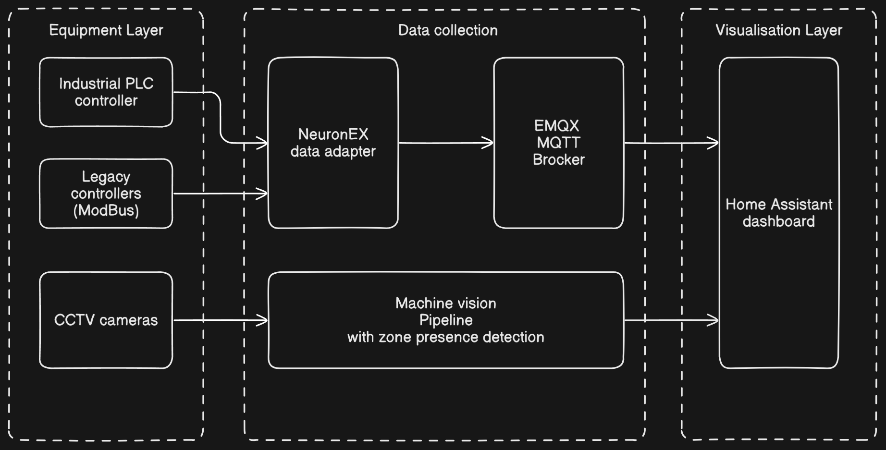

# AI-Enhanced Production Monitoring and Safety System

## Summary

| Company Name                          | [Your Company]           |
| :------------------------------------ | :----------------------- |
| Development Team Lead Name            | [Your Name]              |
| Development Team Lead E-mail          | [your.email@example.com] |
| Duration of the Demonstration Project | [month/year-month/year]  |
| Final Report                          | [Link to final report]   |

# Description

## Objectives of the Demonstration Project

This project aims to implement an integrated production monitoring and safety system leveraging AI technologies to improve manufacturing efficiency and workplace safety. Key objectives include:

1. Aggregate machine data from production equipment into a centralized MQTT broker
2. Implement real-time monitoring of safety zones using AI-powered computer vision
3. Provide historical data visualization alongside security camera footage
4. Create automated alerts for extended presence in maintenance zones
5. Develop a scalable architecture supporting multiple industrial protocols

## Activities and Results of the Demonstration Project

### Challenge

The primary challenge addressed was integrating diverse industrial equipment with varying communication protocols into a unified monitoring system while simultaneously enhancing workplace safety through non-intrusive computer vision technology. The project needed to bridge legacy industrial equipment with modern IoT platforms and provide real-time monitoring capabilities without disrupting existing production processes.

### Data Sources

- OPC UA data streams from industrial PLCs and controllers
- Modbus TCP/IP data from legacy equipment
- Security camera video feeds
- Zone definition configurations
- Machine telemetry data

### AI Technologies

- Google MediaPipe for person detection and tracking
- Custom zone monitoring algorithm for presence detection
- MQTT-based message handling for real-time data processing
- Computer vision pipeline for safety monitoring

### Technological Results

The system underwent comprehensive testing in both laboratory and production environments:

1. **Protocol Testing**: Successfully validated OPC UA and Modbus communication with various equipment types. Testing included verification of data integrity and communication reliability using tools such as FreeOpcUa Client for browsing and identifying OPC UA nodes, MQTTX client for confirming data flow through the MQTT broker, and verification of proper topic structure and message formatting.

2. **Person Detection Accuracy**: MediaPipe demonstrated reliable detection in production environments with varying lighting conditions.

3. **Zone Monitoring Validation**: The system successfully logged entry and exit events with appropriate timestamps, as demonstrated by log outputs:

   ```
   2025-04-10 12:16:25 - Object person_1 (Person) entered 1
   2025-04-10 12:16:39 - Object person_1 (Person) exited (timeout) 1
   ```

4. **End-to-End Integration**: Verified complete data flow from equipment to visualization dashboard, confirming that data from industrial equipment was successfully collected by NeuronEX, messages were properly transmitted via MQTT, zone monitoring events were accurately captured and reported, and all components functioned as an integrated system.

### Technical Architecture

The system architecture consists of four primary layers:

1. **Data Collection Layer**

   - NeuronEX adapter for industrial equipment connectivity
   - OPC UA and Modbus protocol integration
   - Machine telemetry collection

2. **Data Processing Layer**

   - EMQX MQTT broker for message handling
   - NodeJS adapter for data transformation
   - NeuronEX REST API integration

3. **Computer Vision Pipeline**

   - Google MediaPipe for person detection
   - Zone monitoring application
   - Presence duration tracking

4. **Visualization Layer**
   - Home Assistant dashboard
   - Historical data visualization
   - CCTV footage integration



### User Interface

The user interface is built on Home Assistant, providing a comprehensive dashboard for monitoring production:

1. **Telemetry Display**: Real-time visualization of machine operational parameters. Data from the MQTT broker is consumed by Home Assistant through its MQTT integration, allowing for real-time updates of machine status and performance metrics.

2. **Historical Data**: Trend analysis and historical performance metrics. Home Assistant stores historical data in its time-series database, enabling trend visualization and performance analysis over time.

3. **Camera Integration**: CCTV footage display alongside relevant machine data. The system integrates security camera feeds into the dashboard, providing visual context for the production environment and enabling operators to correlate machine data with visual observations.

4. **Alert Management**: Visual indicators for safety zone violations and extended presence alerts. The system configures alerts based on data received through MQTT topics, with customizable thresholds for different safety zones.

5. **Data Access**: Home Assistant provides both a web interface and mobile application for accessing production data and receiving alerts, ensuring that relevant personnel have access to critical information regardless of their location.

### Future Potential of the Technical Solution

Several areas have been identified for future development:

1. **Advanced Analytics**: Implement predictive maintenance algorithms based on collected telemetry data
2. **Multi-person Tracking**: Enhance the computer vision pipeline to track multiple individuals within zones simultaneously
3. **Mobile Alerts**: Develop mobile notification capabilities for immediate alert delivery to relevant personnel
4. **Dashboard Customization**: Create role-based dashboard views tailored to different user requirements
5. **Integration with ERP Systems**: Connect production data with enterprise resource planning systems for comprehensive operational visibility
6. **Edge Computing**: Deploy computer vision processing at the edge to reduce network bandwidth requirements and improve response time
7. **Enhanced Security**: Implement certificate-based authentication for MQTT connections and secure access controls
8. **Data Retention Policies**: Develop comprehensive data retention and archiving strategies

### Lessons Learned

The AI-Enhanced Production Monitoring and Safety System successfully demonstrates the potential of integrating industrial protocols, MQTT messaging, and computer vision technologies in manufacturing environments. The implementation provides a robust foundation for improved operational visibility, enhanced safety monitoring, and data-driven decision making.

Key lessons learned include:

1. **Protocol Diversity**: By leveraging NeuronEX's capabilities, the system successfully bridges the gap between various industrial protocols (OPC UA, Modbus) and modern IoT platforms.

2. **Data Centralization**: The EMQX MQTT broker effectively serves as a central hub for all production data, enabling comprehensive monitoring and analysis.

3. **Safety Enhancement**: Computer vision integration with zone monitoring provides an additional layer of safety without requiring expensive dedicated safety systems.

4. **Operational Visibility**: The Home Assistant dashboard delivers real-time and historical data in an accessible format for operators and management.

The modular architecture ensures that the system can evolve to accommodate changing requirements and technological advancements, making it a valuable asset for long-term production optimization and safety management. The containerized deployment model using Docker further enhances scalability and maintainability, allowing for straightforward updates and expansions as needs evolve.
